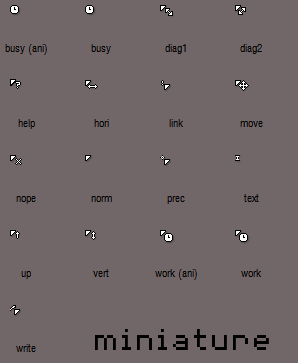

# MINIATURE CURSOR 

A tiny cursor, for Linux and Windows.

This is Miniature, it seeks to be simple and effective, with that nostalgic retro air, now with contrast in black backgrounds, a simple loading animation and support for Windows.

As always just place the miniature folder in ~/.icons/ or /usr/share/icons/

This cursor theme is a port from a Windows cursor originally created by Pyro_
You should be able to find the original [here](http://customize.org/cursor/50932).

MIT
